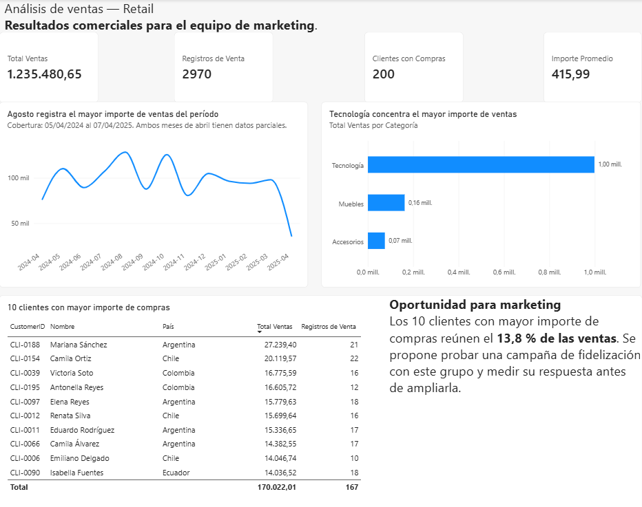

# Retail Sales Analysis - Power BI

## 📊 Project Overview

This project was developed as the final project of my Data Analytics training.

The objective was to analyze retail sales data and transform raw information into clear and useful business insights using Power BI, Power Query, DAX, SQL Server and Excel.

The project includes data cleaning and validation, data analysis, KPI creation and the development of an interactive Power BI dashboard.

## 🎯 Objectives

- Analyze sales performance and customer behavior.
- Clean and validate the dataset before analysis.
- Create KPIs and measures to summarize business performance.
- Explore sales trends and distributions.
- Compare results and validate data consistency.
- Present the results through an interactive Power BI dashboard.

## 🛠️ Tools Used

- **Power BI** - Dashboard development and data visualization.
- **Power Query** - Data cleaning and transformation.
- **DAX** - Measures and analytical calculations.
- **SQL Server** - Data loading, queries and validation.
- **Excel** - Original dataset and initial data source.

## 🧹 Data Preparation

Before building the dashboard, the dataset was reviewed and transformed using Power Query.

The process included:

- Reviewing and correcting data types.
- Cleaning and transforming sales data.
- Detecting inconsistent or incorrect values.
- Validating the information before building the model.
- Checking the final results to ensure data consistency.

## 🗄️ SQL Analysis

SQL Server was used to work with the retail sales database and validate the information used in the analysis.

The database includes information related to:

- Sales
- Customers
- Products

SQL queries were used to analyze and validate the data, including sales activity over recent periods and relationships between the different tables.

The SQL script used in the project is available in:

`retail_final_database_load.sql`

## 📈 Power BI Dashboard

An interactive dashboard was developed in Power BI to transform the analyzed data into clear visual information.

The dashboard includes KPIs and visualizations for total sales, sales records, customers with purchases, average sales amount, monthly sales trends, sales by category and top customers.

DAX measures were used to support the analysis and calculate relevant indicators.

## 📊 Dashboard Preview

## 🔎 Analysis & Business Insights

The analysis showed that **Technology generated the highest sales amount** among the analyzed product categories.

The monthly analysis identified **August as the month with the highest sales amount** within the analyzed period.

The **top 10 customers represented 13.8% of total sales**, which led to a business recommendation to test a targeted loyalty campaign with this customer group and measure its response before expanding the strategy.

The project also included:

- Sales performance analysis.
- Customer and product analysis.
- Comparison of average and median values.
- Analysis of sales over different periods.
- Identification of relevant patterns and business trends.

## 💡 Key Learning

This project allowed me to integrate the complete data analysis workflow:

**Raw Data → Data Cleaning → SQL Analysis → Data Modeling → DAX → Visualization → Business Insights**

It also reinforced the importance of validating data and analytical results before communicating conclusions.

## 📁 Repository Files

- `Bolonio_Giuliana_ProyectoFinal.pbix` - Power BI dashboard.
- `dataset_ventas_retail.xlsx` - Original retail sales dataset.
- `retail_final_database_load.sql` - SQL Server script.
- `dashboard_preview.png` - Dashboard preview.

## 👩‍💻 Author

**Giuliana Bolonio**  
Data Analytics | Power BI | Power Query | SQL | DAX | Excel
